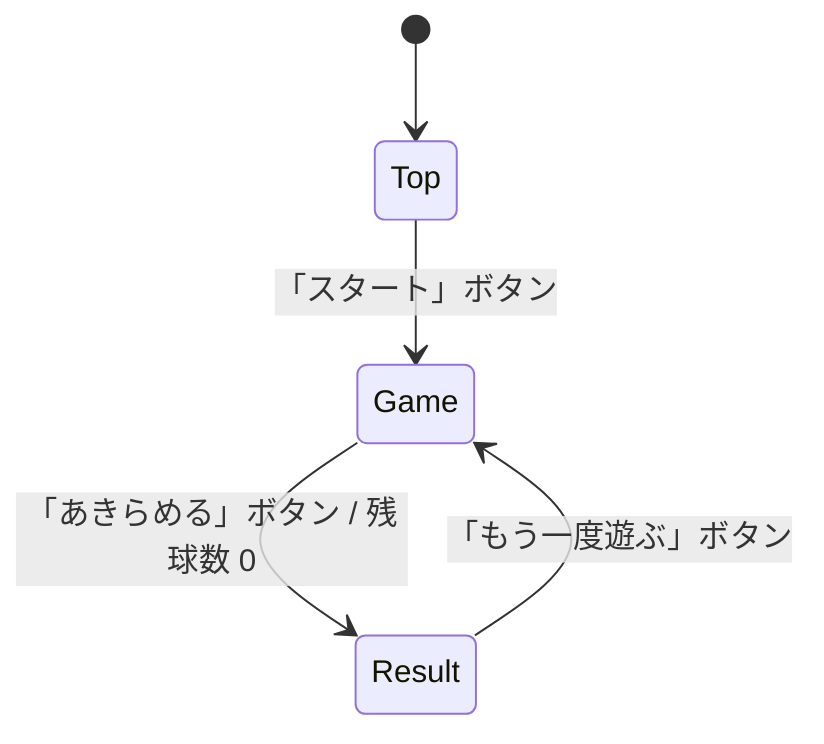

# スマートボール Web アプリ 詳細設計書

> 日本の屋台の定番「スマートボール」をスマホで遊べる Web アプリの詳細設計書。
> 本書は実装着手前の設計合意を目的とする。

---

## 1. 概要 / コンセプト

### 1.1 ゲーム概要
日本の夜店・屋台の定番である「スマートボール」をスマートフォンで遊べる Web アプリ。

- 1ゲームで **20 個**のボールを使用する。
- 画面右下の **バネ式ボタン**を下にスワイプして引っ張り、その量に応じた威力で球を打ち出す。
- 球は盤面上部まで転がり、そこから**釘にはじかれながら**落下する。
- 盤面には **4×4 = 16 マス**の穴が等間隔に並ぶ。球が穴に入るとその場に残り、ビンゴのマスが埋まる。
- 20 球打ち終わった（または「あきらめる」を押した）時点で、**縦・横・斜めに揃った列の数**をカウントする。
- その**列数がスコア**になる。

### 1.2 ターゲット / 利用環境
- **スマートフォンの縦画面**に最適化する。
- タッチ操作（スワイプ・タップ）を主操作とする。
- モダンブラウザ（iOS Safari / Android Chrome）を対象とする。

### 1.3 世界観 / 配色方針
- 常に**日本の夜店・屋台**を連想させる配色とする。
- 暖色系（赤・橙・黄）＋木目＋電球色（暖かい黄白）を基調とする。
- レトロでにぎやかな縁日の雰囲気を演出する（詳細は §10）。

---

## 2. 技術スタック

| 項目 | 採用技術 | 備考 |
| --- | --- | --- |
| マークアップ | HTML | 単一の `index.html` を起点とする |
| 言語 | TypeScript | `JavaScript` にコンパイルして配信 |
| ビルド | Vite | 静的アセットを生成し GitHub Pages に適合 |
| 物理演算 | Matter.js | 釘・壁・穴・球の衝突／反発を担う（§6） |
| 描画 | HTML5 Canvas | Matter.js の Render もしくは独自描画 |
| サウンド | Web Audio API | 効果音のみ（BGM は対象外、§8） |
| スコア保存 | localStorage | ハイスコアをローカル保存（§9） |
| 実行環境 | Node.js | 開発・ビルド時のみ使用（ランタイムでは不要） |

### 2.1 GitHub Pages 制約への適合
- **静的ホスティング**のみ（サーバーサイド処理なし）。すべてクライアントで完結させる。
  - データ保存はサーバーを使わず localStorage を利用する。
- Vite の `base` をリポジトリ名に合わせて設定する（例: `base: '/cc_cf_pachinko/'`）。
  - これによりサブパス配信でもアセット参照が壊れない。
- ビルド成果物（`dist/`）を GitHub Actions で `gh-pages` 相当へデプロイする（§11）。
- 相対パス前提のアセット読み込みとし、絶対パス参照を避ける。

---

## 3. 画面遷移設計

画面は **トップ / ゲーム / 終了** の 3 つ。



| 画面 | 責務 | 遷移トリガー |
| --- | --- | --- |
| トップ | タイトル提示・ゲーム開始の入口 | 「スタート」→ ゲーム |
| ゲーム | 球の発射・物理シミュレーション・盤面状態管理 | 「あきらめる」/ 残球 0 → 終了 |
| 終了 | スコア（列数）と誉め言葉・ハイスコア表示 | 「もう一度遊ぶ」→ ゲーム |

- 画面遷移は SPA 的に **1 ページ内の状態切り替え**で実現（ページ遷移はしない）。
- 状態は `ScreenState = 'top' | 'game' | 'result'` で管理する。

---

## 4. 画面別 UI 設計

### 4.1 トップ画面
- タイトル「**スマートボール**」を大きく表示（屋台の看板風）。
- 画面**中央下部**に「**スタート**」ボタン。押下でゲーム画面へ遷移。
- 背景は縁日の雰囲気（提灯・木目など）。

### 4.2 ゲーム画面
添付参考画像のレイアウトに準じる。

- **盤面**: 上部に球が転がる曲線レーン、中央に 4×4 の穴、各所に釘を配置。
- **残球数表示**: 画面下部に現在の残球数を常時表示（例: `のこり 12`）。
- **発射ボタン（バネ式）**: 画面**右下**に配置。下方向へスワイプして引っ張る。
  - 引っ張った量（スワイプ距離）に比例して発射威力が変化する。
  - 指を離すと球が発射される。引っ張り中はゲージ等で威力を可視化する。
- **「あきらめる」ボタン**: 画面**上部**に配置。押下で現時点の揃い列数を確定し終了画面へ。
- 穴は**黒い円**、ボールは**白い円**で表現する。穴が埋まった状態は「黒い穴の上に白いボールが留まっている」描画で表す（§10 参照）。

### 4.3 終了画面
- ゲーム画面で確定した**列数をスコア**として表示。
- 列数に応じた**誉め言葉**を表示（§5.3）。
- **ハイスコア**を併記（localStorage、§9）。
- 画面**中央下部**に「**もう一度遊ぶ**」ボタン。押下でゲーム画面へ遷移。

---

## 5. ゲームロジック / データモデル

### 5.1 データモデル
```ts
// 盤面: 4×4 の各セルが埋まっているか
type Board = boolean[][]; // [row][col], 4x4

interface GameState {
  screen: 'top' | 'game' | 'result';
  ballsRemaining: number; // 残球数（初期値 20）
  board: Board;           // 穴の埋まり状況
  power: number;          // 現在の発射威力（0..1）
  activeBalls: Ball[];    // 盤面上で運動中の球
  score: number;          // 揃った列数（終了時に確定）
  highScore: number;      // localStorage 由来
}

interface Ball {
  body: Matter.Body;      // 物理ボディ
  state: 'flying' | 'settled' | 'removed';
}
```

定数:
- `TOTAL_BALLS = 20`
- `GRID_SIZE = 4`（4×4）
- `HOLE_COUNT = 16`

### 5.2 ボールのライフサイクル
1. **発射（flying）**: 発射ボタンの引っ張り量から威力を決定し、球に初速/力を与える。
2. **落下**: 釘・壁に衝突しながら落下（Matter.js が担当）。
3. **穴入り（settled）**: 穴のセンサーに到達した球はその位置に固定し、当たり判定を残す。対応セルを `true` に。球は穴の中で**白いボール**として描画し続ける（穴が埋まった状態の視覚表現、§10 参照）。
4. **消滅（removed）**: 穴に入らず最下部へ到達した球はワールドから除去する。
5. 球が静止（settled / removed）したら残球数を確認し、`0` なら終了処理へ。

> 補足: 同じ穴に複数球が入った場合も、そのセルは「埋まり（true）」として 1 度だけカウントする。

### 5.3 スコア（揃い列）判定
4×4 のビンゴ要領で、**全マスが埋まっている列**を数える。

- 縦 4 列 + 横 4 列 + 斜め 2 列 = **最大 10 列**。
- スコア = 揃った列数。

```ts
function countLines(board: Board): number {
  let lines = 0;
  // 横
  for (let r = 0; r < 4; r++) if (board[r].every(Boolean)) lines++;
  // 縦
  for (let c = 0; c < 4; c++) if (board.every(row => row[c])) lines++;
  // 斜め（左上→右下、右上→左下）
  if ([0,1,2,3].every(i => board[i][i])) lines++;
  if ([0,1,2,3].every(i => board[i][3 - i])) lines++;
  return lines; // 0..10
}
```

誉め言葉（終了画面）:

| 列数 | メッセージ |
| --- | --- |
| 0 | 残念 |
| 1〜3 | すごい！ |
| 4〜9 | とても上手！ |
| 10 以上 | パーフェクト！ |

> 最大値は 10 のため「10 以上」は実質「10（＝全マス）」を指す。要件の閾値と整合する。

---

## 6. 物理演算設計（Matter.js）

### 6.1 ワールド
- `Engine` を生成し、重力 `gravity.y` を下方向に設定（縦画面に合わせ調整）。
- 描画は Matter.js の `Render`、または独自 Canvas 描画レイヤーを重ねる。

### 6.2 静的オブジェクト（static body）
- **釘**: 小円の static body を盤面に配置。球がはじかれる。反発係数（`restitution`）を調整。
- **壁 / ガイド曲線**: 盤面外周と上部の曲線レーンを static body（または頂点集合）で構成。球の進入経路を作る。

### 6.3 穴（センサー判定）
- 各穴を `isSensor: true` のボディとして配置。
- `collisionStart` イベントで球が穴に重なったら、その球を `settled` にしてセル `true` に更新。
  - 物理的に「残す」表現は、球をその穴位置にスナップ固定する、または静止ボディ化する。

### 6.4 ボール（dynamic body）
- 円形 dynamic body。`restitution` / `friction` を屋台らしい挙動に調整。
- 発射時に右下のレーン入口へ配置し、初速または力を与える。

### 6.5 発射の力 / 威力マッピング
- スワイプの引っ張り距離 `d`（0..maxPull）を正規化して威力 `power = clamp(d / maxPull, 0, 1)`。
- 発射時の力 = `power` に応じた力ベクトルを上方向（レーンに沿う向き）へ付与。
- 弱すぎ／強すぎを防ぐため最小・最大威力をクランプする。

---

## 7. 入力設計

- **Pointer Events**（`pointerdown` / `pointermove` / `pointerup`）でタッチ・マウス双方に対応。
- **発射操作**:
  - 発射ボタン上で `pointerdown` → 引っ張り開始。
  - `pointermove` の下方向移動量から威力を算出し、ゲージへ反映。
  - `pointerup` で発射、威力リセット。
- **ボタン操作**: 「スタート」「あきらめる」「もう一度遊ぶ」はタップで反応。
- スクロール・ピンチズーム等のブラウザ既定動作を無効化（`touch-action: none` 等）。

---

## 8. サウンド設計

効果音のみ（BGM なし）。Web Audio API で短い効果音を再生する。

| 効果音 | 発生タイミング |
| --- | --- |
| 発射音 | 球を発射した瞬間 |
| 釘ヒット音 | 球が釘に衝突したとき |
| 穴入り音 | 球が穴に入ったとき |
| ビンゴ音 | 新たに列が揃ったとき |
| 終了音 | ゲーム終了（終了画面遷移）時 |

- 初回のユーザー操作で `AudioContext` を resume（モバイルの自動再生制約対策）。
- 連続ヒット時の多重再生に耐えるよう、短いバッファを使い回す。
- 音源ファイルは別途用意（未確定、§13）。当面は軽量な合成音（オシレータ）でも可。

---

## 9. スコア保存設計

- ストレージ: `localStorage`。
- キー: `smartball.highScore`。
- 値: 数値（最高列数）を文字列で保存。
- 更新ロジック:
  1. 終了時に今回スコア `score` を算出。
  2. `highScore = max(savedHighScore, score)` を計算し保存。
  3. 終了画面に今回スコアとハイスコアを表示。
- 初回・パース失敗時は `0` として扱う。

---

## 10. 配色 / デザインガイド

縁日・屋台の雰囲気を出すカラーパレット（目安）:

| 用途 | 色 | 例 |
| --- | --- | --- |
| 木枠・盤面フレーム | 木目ブラウン | `#A9743B` 〜 `#7A4A1E` |
| 背景（夜店の夜） | 深い紺 | `#1B2A4A` |
| アクセント（赤提灯） | 朱赤 | `#E23B2E` |
| アクセント（黄電球） | 暖黄 | `#F6C445` |
| 強調・成功 | 橙 | `#F08A24` |
| テキスト | 生成り/白 | `#FFF7E6` |
| **穴（空き）** | 黒 | `#111111` |
| **ボール / 穴（埋まり）** | 白 | `#FFFFFF` |

### 穴の描画ルール
- 穴は常に**黒い円**で描画する（`#111111` 相当）。
- 運動中のボールは**白い円**で描画する（`#FFFFFF` 相当）。
- 穴に入った（settled）ボールは、**黒い穴の上に白い円をそのまま表示**することで「穴が埋まった状態」を表現する。
  - 穴の黒円（背景）→ 白い球（前景）の順で描画すると視覚的に「穴に球が収まっている」ように見える。
- 空き穴と埋まり穴はこの白/黒のコントラストで一目で区別できる。

- タイトルや見出しは**レトロでにぎやかな**装飾フォント（毛筆・丸ゴシック系）を検討。
- ボタンは木札・看板風のデザインで統一感を出す。
- フォントは Web フォントを使う場合も GitHub Pages から配信できる形にする。

---

## 11. 推奨ディレクトリ構成 & ビルド / デプロイ

> 本タスク（設計書作成）では作成しない。次ステップの参考構成。

```
cc_cf_pachinko/
├─ index.html
├─ package.json
├─ tsconfig.json
├─ vite.config.ts        # base: '/cc_cf_pachinko/'
├─ src/
│  ├─ main.ts            # エントリ・画面状態管理
│  ├─ screens/           # top / game / result
│  ├─ game/              # 物理・ボード・スコアロジック
│  ├─ audio/             # 効果音
│  └─ styles/            # CSS
├─ public/               # 画像・音源など静的アセット
├─ docs/
│  └─ detailed-design.md # 本書
└─ .github/workflows/
   └─ deploy.yml         # GitHub Pages へ自動デプロイ
```

デプロイ（想定）:
- `main`（または対象ブランチ）push をトリガーに GitHub Actions で `npm ci && npm run build`。
- `dist/` を GitHub Pages（`actions/deploy-pages`）へ公開。

---

## 12. レスポンシブ / スマホ最適化

- **縦画面前提**のレイアウト（縦長アスペクト比の盤面）。
- `<meta name="viewport" content="width=device-width, initial-scale=1, viewport-fit=cover">`。
- Canvas は論理解像度を固定し、CSS で画面幅にフィットさせる（`devicePixelRatio` 考慮）。
- セーフエリア（ノッチ等）を `env(safe-area-inset-*)` で考慮。
- 横画面時は「縦にしてください」案内、または縦想定でのスケーリングに留める。

---

## 13. 今後の課題 / 未確定事項

- **BGM**: 今回は対象外。将来追加する余地を残す。
- **効果音の音源**: 実ファイルの用意（合成音で代替するか要検討）。
- **難易度調整**: 釘配置・重力・反発係数・穴の当たり判定サイズのチューニング。
- **盤面デザイン**: 参考画像をどこまで再現するか（イラスト素材の用意）。
- **演出**: ビンゴ成立時やパーフェクト時のエフェクト。
